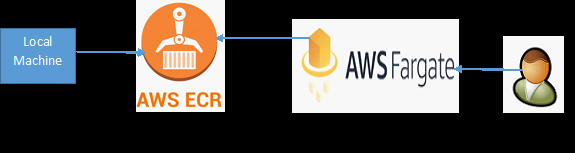

<h>**Wikipedia Data Analytics**</h>

Wikipedia data is ingested using below link: 
https://dumps.wikimedia.org/simplewiki/latest/

The schema information is given at below location:
https://meta.wikimedia.org/wiki/Data_dumps/What%27s_available_for_download#Database_tables

This project contains two folders: 
1.Wikipedia Ingestion:
  This folder contains standalone Python code which ingests data in AWS RDS MYSQL database for
category, categorylinks and page tables. This code can be automated using
CRON or Airflow.

2.Wikipedia Assistant:
  This folder contains below Flask endpoints: 
   a. Arbitrary SQL:
     This POST endpoint takes arbitrary SQL query in a body and returns the output.
   b. Outdated page for given category endpoint 
     This GET endpoint takes category as a query parameter and returns the most outdated page associated to that category. 
     The spaces in the category will be replaced by _ in API code and then it is queried against outdated_pages table.
     The query which computes top10 categories, and their associated outdated pages is computed separately once per month, and the results are populated in outdated_pages table 
     in AWS RDS MySQL database. The endpoint accesses outdated_pages table and returns the outdated page for the given category.

Wikipedia Assistant endpoints deployment:
1.  Dockerhub-EC2 approach
    

    

Local machine builds the docker image then pushes to the docker hub. Docker is installed on EC2 instance where docker image 
is pulled from docker hub and docker container is up and running. Client then accesses the endpoints.
    
2. Local machine-ECR-ECS Fargate way
   

   
   
  Docker image is pushed from local machine to AWS ECR. AWS ECS Fagate cluster is created. While creating Fargate tasks, URI of this ECR image is given 
and when we run this task, the application is up. Then client can hit the endpoint and get the result.
